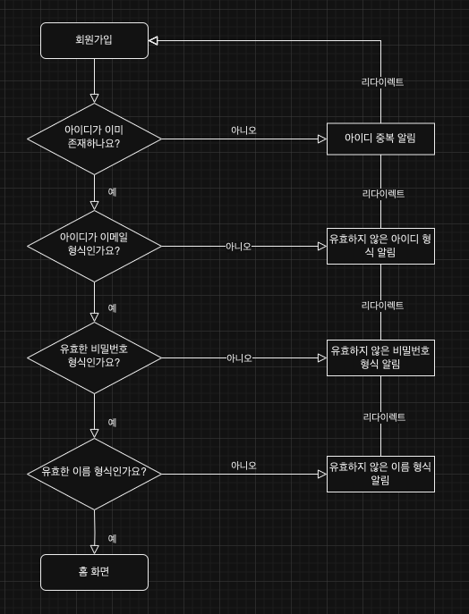
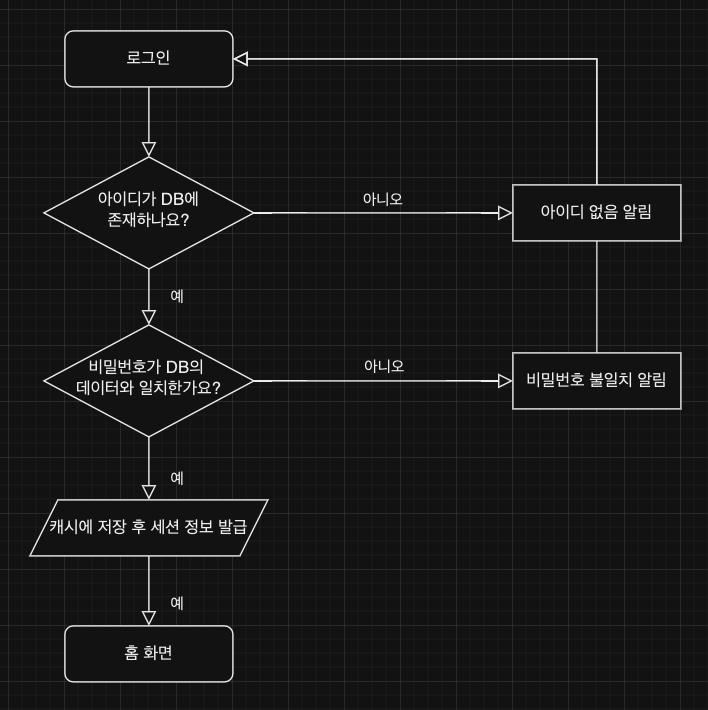
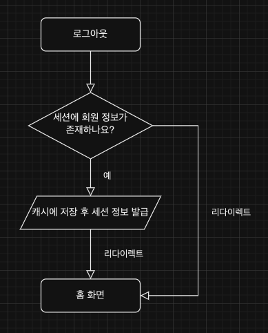
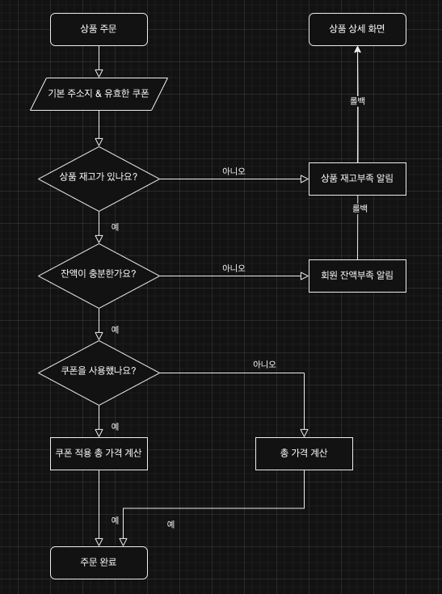
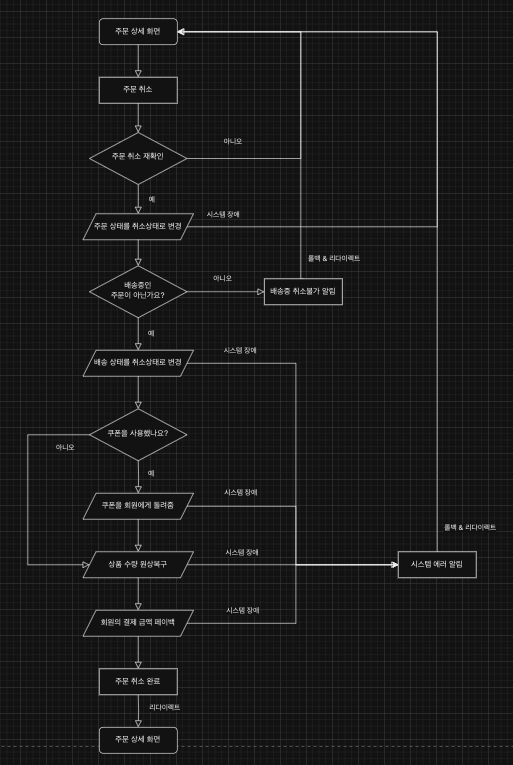
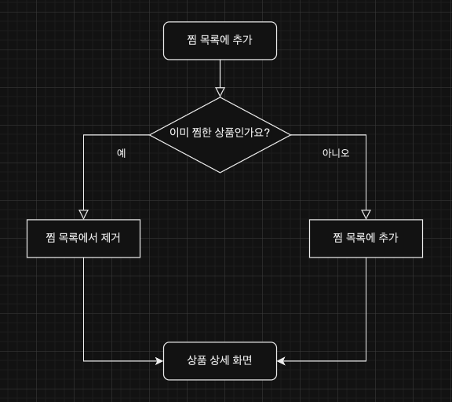
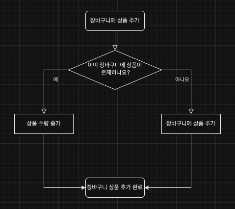
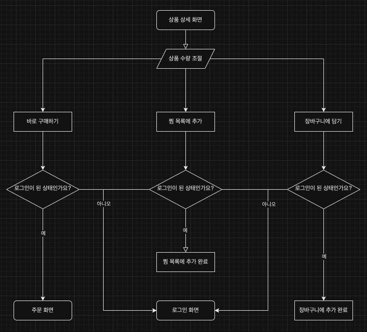

# Shopping Mall Project with Servlet

## ⚙️ 개발 환경(Development Environment)

| 분류              | 개발환경                                            | 
|-----------------|-------------------------------------------------|
| 운영체제            | Mac OS, Windows                                 |
| 개발도구            | Intellij IDEA, Maven, Notion, ERDCloud, draw.io |
| 기술 스택           | Java, Servlet & JSP, MyBatis, Tomcat            |
| 데이터베이스          | MySQL                                           |
| 버전 관리           | Github, Git                                     |
| 오픈소스 및 외부 라이브러리 |                                                 |

## 🛠 세부 기술 스택(Tech Stack)

- **Java(JDK 11)**
- **Servlet(4.0.1)**
    - JSP
- **MyBatis**

### 데이터베이스(Database)

- **MySQL** - development, production
- **H2** - test

## 비즈니스 로직 흐름도

- 각 도메인별로 중요한 흐름도만 제작하였습니다. 참고 바랍니다.

### 회원

**📌 회원가입**

**📌 로그인**

**📌 로그아웃**

### 주문

**📌 주문 생성**

**📌 주문 삭제**

### 찜

**📌 찜 목록에 추가**

### 장바구니

**📌 장바구니에 추가**

### 상품

**📌 상품 상세조회**

## 기능 명세서

[바로가기](https://www.notion.so/c5cc529cde524a0eacd7433be5466aa4?v=c4f6ef4260724835ba010543be9dbb35&pvs=4)

## ERD & Diagram

[바로가기](https://www.erdcloud.com/d/HnnmsKsQ4Q9ztQy4K)
