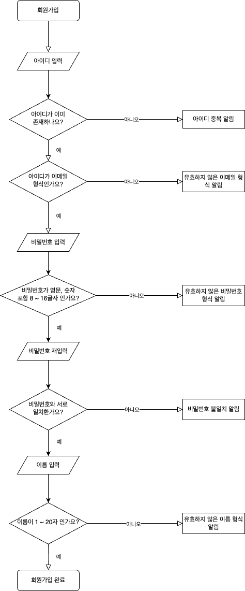
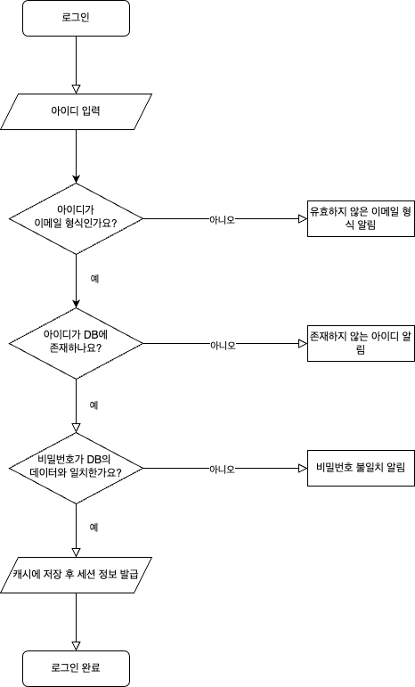
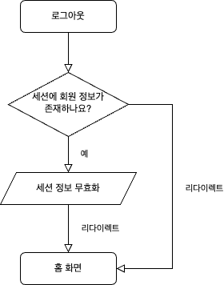
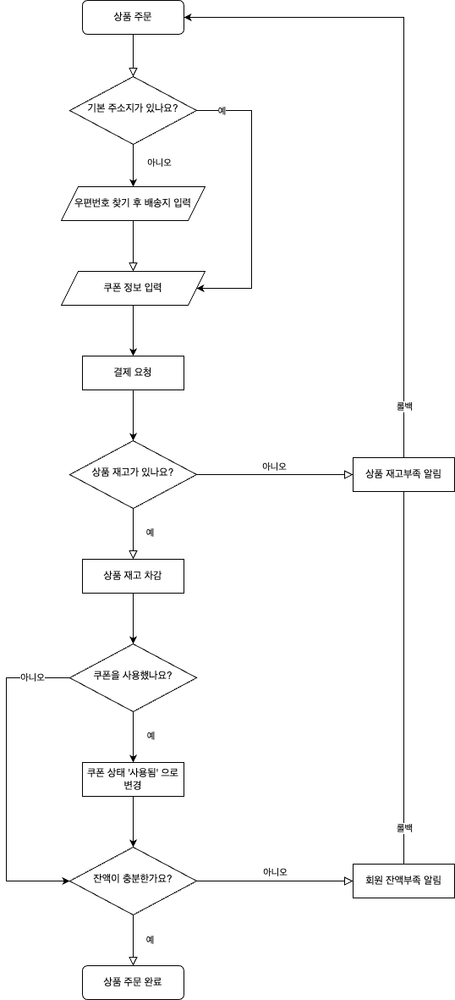
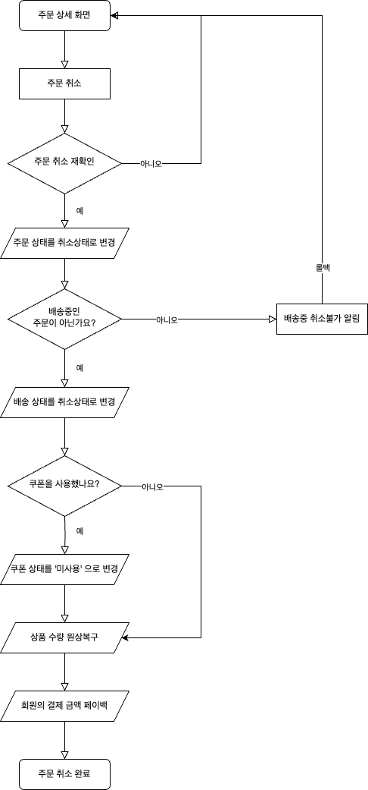
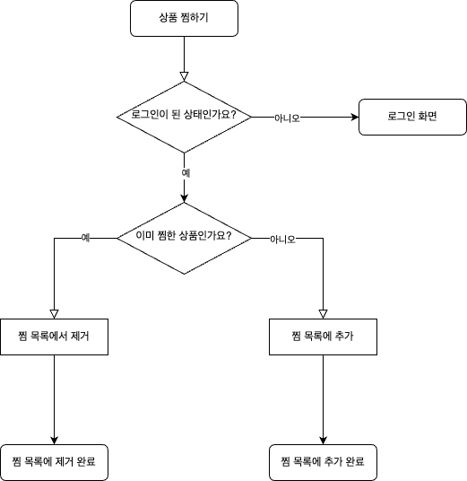
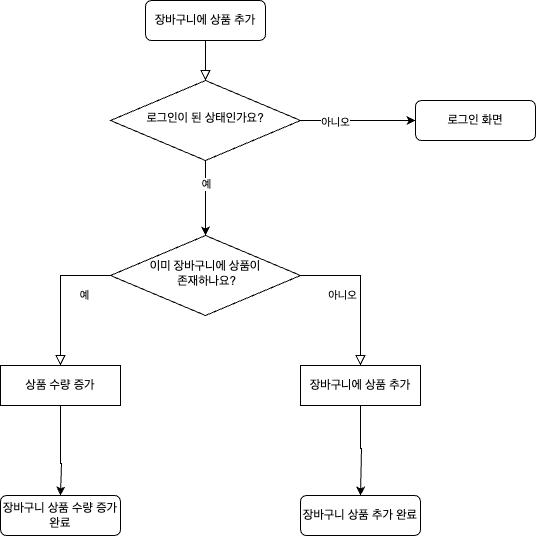
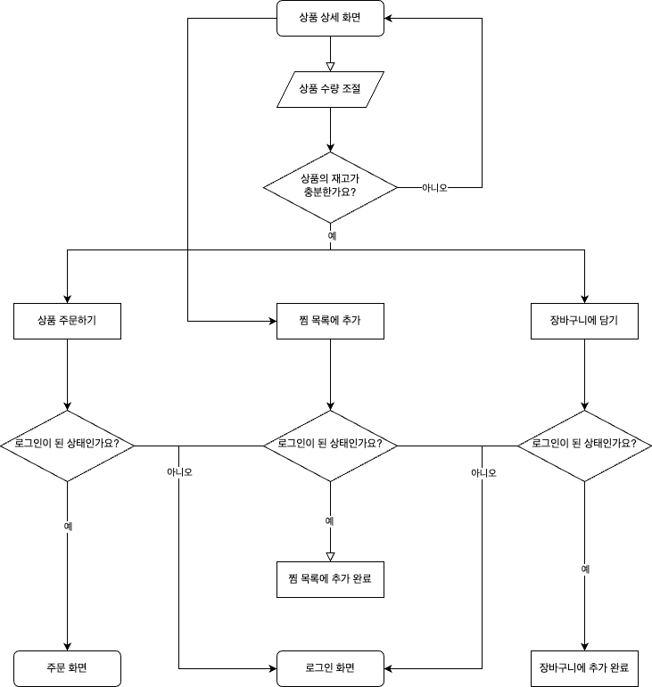

# Shopping Mall Project with Servlet

## ⚙️ 개발 환경(Development Environment)

| 분류              | 개발환경                                                   | 
|-----------------|--------------------------------------------------------|
| 운영체제            | Mac OS, Windows                                        |
| 개발도구            | Intellij IDEA, Maven, Notion, ERDCloud, draw.io        |
| 기술 스택           | Java, Servlet & JSP, MyBatis, Tomcat                   |
| 데이터베이스          | MySQL                                                  |
| 버전 관리           | Github, Git                                            |
| 배포 및 운영         | Jenkins, AWS                                   |
| 오픈소스 및 외부 라이브러리 | Bootstrap, Kakao Login API, I'm PORT Kakao Payment API |

## 🛠 세부 기술 스택(Tech Stack)

- **Java(JDK 11)**
- **Servlet(4.0.1)**
    - JSP
- **HTML, CSS, JavaScript**
- **MyBatis**

### 데이터베이스(Database)

- **MySQL** - development, production
- **H2** - test

## 비즈니스 로직 흐름도

- 각 도메인별로 중요한 흐름도만 제작하였습니다. 참고 바랍니다.

### 회원

**📌 회원가입**

1. 회원이 회원가입란에 아이디를 입력한다.
   - 이미 존재하는 아이디라면 아이디 검증란에서 재입력을 요구한다.
   - 아이디가 유효하다면 아이디가 이메일 형식인지 검증한다.
      - 아이디가 이메일 형식이 아니라면 아이디 검증란에서 재입력을 요구한다.
2. 회원이 회원가입란에 비밀번호를 입력한다.
   - 비밀번호를 유효한 형식(8자 ~ 16자)으로 입력하지 않았다면 비밀번호 검증란에서 재입력을 요구한다.
   - 비밀번호 입력과 재입력란을 동일하게 입력하지 않았다면 비밀번호 검증란에서 재입력을 요구한다.
3. 회원이 회원가입란에 이름을 입력한다.
   - 이름을 유효한 형식(1자 ~ 20자)으로 입력하지 않았다면 이름 검증란에서 재입력을 요구한다.
4. 회원이 가입 완료버튼을 클릭하여 회원가입을 완료한다.

**📌 로그인**

1. 회원이 로그인란에 아이디를 입력한다.
   - 아이디가 이메일 형식인지 검증하고 아니라면 아이디 재입력을 요구한다.
2. 회원이 로그인란에 비밀번호를 입력한다.
4. 회원이 로그인 버튼을 클릭하여 로그인을 완료한다.
   - 만약 DB에 아이디가 존재하지 않는다면 로그인 입력란에서 재입력을 요구한다.
   - 만약 DB에 존재하는 아이디에 해당하는 비밀번호가 일치하지 않는다면 로그인 입력란에서 재입력을 요구한다.

**📌 로그아웃**

1. 회원이 로그아웃 버튼을 클릭하여 로그아웃을 요청한다.
   - 이미 세션이 만료되어 로그아웃 상태라면 단순하게 홈 화면으로 리다이렉팅한다.
2. 세션에 회원 정보가 존재한다면 세션 정보를 무효화시킨다.
3. 로그아웃이 완료되면 홈 화면으로 리다이렉팅한다.

### 주문

**📌 주문 생성**

1. 회원이 상품 주문 요청을 시도한다.
2. 회원은 배송지를 입력한다.
   - 기본 주소지가 있다면 상품 주문 폼에서 기본 주소지가 미리 세팅된다.
   - 기본 주소지가 없다면 우편번호 찾기 버튼을 클릭하여 주소지를 찾아서 세팅한다.
3. 회원이 보유한 쿠폰 정보가 있다면 적용한다.
4. 주문 폼을 모두 입력했다면 결제요청을 시도한다.
   - 상품의 재고가 부족하다면 상품 재고부족 알림을 한 후 롤백한다. 아니면 상품의 재고를 차감한다.
   - 쿠폰을 사용했다면 쿠폰 상태를 사용됨으로 변경하고 아니라면 넘어간다.
   - 회원의 잔액이 충분하지 않다면 회원 잔액부족 알림을 한 후 롤백한다.
5. 모든 검증이 정상이라면 상품 주문이 정상적으로 완료된다.

**📌 주문 삭제**

1. 회원이 상품 주문 상세조회 화면에서 주문 취소를 시도한다.
   - 회원이 취소버튼을 잘못 누를것을 대비해서 주문 취소를 재확인을 시도한다.
   - 주문 취소를 잘못눌렀다면 돌아가기 버튼을 클릭해서 되돌아간다.
   - 주문 취소를 원한다면 확인 버튼을 눌러서 주문 취소를 시도한다.
2. 해당 주문의 상태를 취소 상태로 변경한다.
3. 해당 주문의 배송 상태를 취소상태로 변경한다.
4. 회원이 해당 주문을 할 때 쿠폰을 사용했는지 확인한다.
   - 쿠폰을 사용했다면 적용했던 쿠폰을 '미사용'으로 변경한다.
   - 쿠폰을 사용하지 않았다면 넘어간다.
5. 해당 주문에 존재하는 상품들의 수량들을 원상 복구한다.
6. 회원이 상품을 주문할 때 결제했던 금액을 되돌려준다.
7. 모든 검증이 정상이라면 상품 주문 취소가 정상적으로 완료된다.

### 찜

**📌 찜 목록에 추가**

1. 회원은 상품 목록화면이나 상품 상세보기 화면에서 찜 버튼을 클릭한다.
   - 로그인하지 않은 사용자라면 로그인 화면으로 리다이렉팅한다.
2. 해당 상품을 찜 목록에 추가한다.
   - 만약 해당 상품이 이미 찜 목록에 존재한다면 찜 목록에서 제거한다.
   - 그게 아니라면 찜 목록에 해당 상품을 추가한다.
3. 찜 목록에 해당 상품 추가가 정상적으로 완료된다.

### 장바구니

**📌 장바구니에 추가**

1. 회원은 상품 목록화면이나 상품 상세보기 화면에서 장바구니 버튼을 클릭한다.
   - 로그인하지 않은 사용자라면 로그인 화면으로 리다이렉팅한다.
2. 해당 상품을 장바구니 목록에 추가한다.
   - 만약 해당 상품이 이미 장바구니 목록에 존재한다면 장바구니에 있는 해당 상품의 수량을 증가시킨다.
   - 그게 아니라면 장바구니 목록에 해당 상품의 수량을 1로 추가한다.
3. 장바구니 목록에 해당 상품 추가가 정상적으로 완료된다.

### 상품

**📌 상품 상세조회**

1. 회원은 상품 상세화면에서 상품 주문, 찜 목록에 추가, 장바구니에 추가를 할 수 있다.
   - 상품 주문이나 장바구니 추가 시 로그인하지 않은 사용자라면 로그인 화면으로 리다이렉팅한다.
2. 상품 상세화면에서 상품 수량을 조절하여 상품을 주문하거나 장바구니에 추가할 수 있다.
   - 해당 상품의 재고가 충분하지 않다면 재고가 충분하지 않다는 알림이 뜬다.
   - 해당 상품의 재고가 충분하다면 상품 주문 시 회원이 담은 수량이 그대로 상품 주문에 전달된다.
   - 해당 상품의 재고가 충분하다면 장바구니 추가 시 회원이 담은 수량이 그대로 장바구니 목록에 추가된다.

## 기능 명세서

[바로가기](https://www.notion.so/c5cc529cde524a0eacd7433be5466aa4?v=c4f6ef4260724835ba010543be9dbb35&pvs=4)

## ERD & Diagram

[바로가기](https://www.erdcloud.com/d/HnnmsKsQ4Q9ztQy4K)
